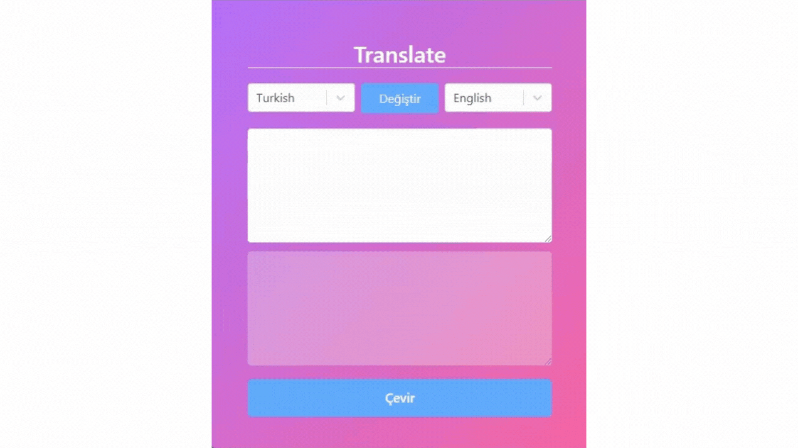

## Translate Projesi

Bu proje, kullanıcıların metinleri farklı dillere çevirebilmelerine olanak tanır. Proje, Redux Toolkit ve Axios gibi kütüphaneleri kullanarak, React ve Tailwind CSS ile geliştirilmiştir. Ayrıca, kullanıcı arayüzü için React Redux ve React Select kütüphaneleri kullanılmıştır.

## Kullanılan Kütüphaneler

- @reduxjs/toolkit: Redux uygulamaları için kullanılan bir kütüphane. Bu proje, durum yönetimi için Redux Toolkit'i kullanır.
- axios: HTTP isteklerini yapmak için kullanılan bir kütüphane. Bu proje, API istekleri yapmak için Axios'u kullanır.
- react-redux: React uygulamalarında Redux'u kullanmayı kolaylaştıran bir kütüphane. Bu proje, Redux'un React entegrasyonunu sağlamak için react-redux'u kullanır.
- react-select: Daha iyi bir kullanıcı deneyimi sunmak için özelleştirilebilir bir seçim bileşeni sağlayan bir kütüphane. Bu proje, dil seçiminde react-select'i kullanır.
- tailwind: Hızlı ve modern bir CSS çerçevesi. Bu proje, kullanıcı arayüzü tasarımı için Tailwind CSS'i kullanır.

## ScreenCast

